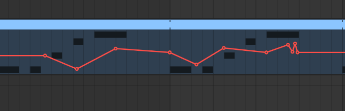
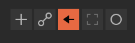
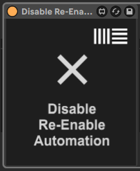

# Disable Re-Enable Automation
> Plugin made especially for Ableton Live

## Why do I need this?
Let's imagine you wrote a cool automation with Nexus 4 like that one:

But then you want to try other presets. You choose them in Nexus interface and then...
This demon pops up:

All of your pretty automations are disabled and you have to click this `Re-Enable Automation` button every time you change anything in your synth. So annoying

## And this is the point where the game changes
Just add my plugin to any return channel (e.g. master channel) and click the cross so it looks like this:

And now you can just forget about re-enabling automation!

## Installation
Nothing hard. You just place the `Disable Re-Enable Automation.amxd` to your plugins directory and then you can just drag it to your main return track in Ableton Live. It doesn't affect the sound at all cause it just bypasses incoming audio (you can check it in Max For Live).

---

> All rights for Ableton Live logo are reserved by Ableton, I don't own or encroach anything, please don't sue me, I just wanted the plugin to look nice.